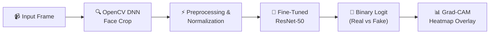

# 🛡️ Deepfake Detection System

A state-of-the-art Deepfake Detection system powered by a fine-tuned ResNet-50 neural network, complete with real-time face preprocessing, interactive Gradio frontend, and explainable AI insights (Grad-CAM visualization).

🚀 **Live Interactive Demo:** [Hugging Face Space — Shri04/deepfake-detector](https://huggingface.co/spaces/Shri04/deepfake-detector)

---

## 🛠️ Tech Stack

This project was built from the ground up using a modern, lightweight, and robust machine learning stack:

*   **Deep Learning Framework**: PyTorch
*   **Computer Vision**: OpenCV (DNN Caffe model for real-time face detection), Pillow
*   **Feature Extractor & Backbone**: Torchvision (ResNet-50 pre-trained on ImageNet-1K V2)
*   **Data Augmentation**: Albumentations (advanced geometric and compression-simulating augmentations)
*   **Visualization & Explainability**: Matplotlib & PyTorch hooks (custom Grad-CAM implementation)
*   **Serving & UI**: Gradio (for interactive image, video, and live webcam inference)
*   **Deployment**: Hugging Face Spaces (CPU runtime environment)

---

## 🚨 The Problem

Facial manipulation techniques (commonly known as **deepfakes**) have advanced rapidly due to accessible generative AI tools (such as GANs and Diffusion models). Deepfakes pose serious societal threats, including:
1.  **Spread of Misinformation**: Creating convincing but fake videos/images of public figures.
2.  **Identity Theft & Fraud**: Bypassing facial recognition authentication systems.
3.  **Loss of Digital Trust**: Diluting the credibility of digital video and photo evidence.

Our goal was to train a fast, reliable model capable of determining whether a face is **REAL** or **FAKE** from static images, video files, or webcam feeds.

---

## 🧠 The Approach

To build a high-performance deepfake detector, we adopted a structured **Transfer Learning** methodology.



### 1. Why ResNet-50 & Transfer Learning?
*   **Rich Pre-trained Features**: Models trained on ImageNet already excel at extracting low-level (edges, textures) and high-level (shapes, structures) features. We don't need millions of images to teach the network what a face looks like.
*   **Efficiency**: ResNet-50 strikes the perfect balance between parameter capacity and runtime speed. It is light enough to run inference on a CPU (suitable for free-tier Hugging Face Spaces) while retaining high classification power.

### 2. How the Pipeline Works
*   **Face-Centric Preprocessing**: Deepfakes typically contain local anomalies (e.g., blending boundaries, color mismatches, double edges) around the eyes, nose, mouth, and jawline. Pushing a full image to the network dilutes the signal. We use an **OpenCV DNN Face Detector** to localize, crop, and pad the face region, resizing it to a square $224 \times 224$ input.
*   **Custom Classification Head**: We replaced the default ImageNet fully connected layer with a custom classifier:
    $$\text{Global Average Pooling} \rightarrow \text{Dropout (0.5)} \rightarrow \text{Linear (2048 to 512)} \rightarrow \text{ReLU} \rightarrow \text{Batch Normalization} \rightarrow \text{Dropout (0.25)} \rightarrow \text{Linear (512 to 1)}$$
*   **Explainable AI (Grad-CAM)**: To build trust, we implemented a custom **Grad-CAM** (Gradient-weighted Class Activation Mapping) module. It captures gradients flowing into the final convolutional layer of ResNet to generate a heatmap showing *exactly* where the model focused (e.g., weird textures around eyes or mouth borders).

---

## 📊 Dataset & Training Details

### The Dataset
The model was trained on the **Ciplab Real and Fake Face Detection Dataset** (~4,000 images). This dataset contains complex real and high-quality fake faces with diverse illumination conditions, backgrounds, and compression artifacts.

### Training Strategy
1.  **Augmentation Strategy**: We used Albumentations to apply aggressive geometric transforms (rotations, flips) alongside degradation transforms (JPEG compression artifacts, Gaussian noise, blur) to make the model highly robust to poor quality/compressed inputs.
2.  **Regularization**:
    *   **Label Smoothing (0.1)** to prevent the model from becoming overly confident.
    *   **Focal Loss** to handle class distribution dynamics.
    *   **Cosine Annealing learning rate schedule** with progressive unfreezing (keeping backbone layers frozen initially and unfreezing them progressively to fine-tune deep features).

---

## 📈 Results & Performance

On the validation split, the model achieved outstanding performance metrics:

| Metric | Value |
| :--- | :--- |
| **AUC-ROC** | **0.9424** |
| **Accuracy** | **87.25%** |
| **Precision** | **87.27%** |
| **Recall** | **84.81%** |
| **F1 Score** | **86.02%** |
| **Equal Error Rate (EER)** | **12.41%** |

You can find the ROC curves and confusion matrix plots generated during evaluation in the `models/plots/` folder.

---

## 🔮 Future Roadmap

While the model performs exceptionally well on individual faces, the future of deepfake detection requires expanding beyond static spatial features:

1.  **Temporal Consistency (Video)**: Deepfakes in videos often look convincing frame-by-frame but have temporal inconsistencies (e.g., flickering, unnatural blinking rates). We plan to incorporate **3D CNNs (Res3D)** or sequential modeling (e.g., **LSTMs/Transformers**) to analyze frame transitions.
2.  **Audio-Visual Multi-Modal Detection**: Modern deepfakes also manipulate voice (voice cloning). Incorporating audio analysis to check if the mouth movement aligns perfectly with the speech frequencies (lip-sync verification) would drastically improve robustness.
3.  **GAN/Diffusion Signature Analysis**: Training the network to detect specific high-frequency noise patterns left behind by popular generative architectures (e.g., StyleGAN, Stable Diffusion, Midjourney).
4.  **Edge & Mobile Optimization**: Applying model pruning and quantization (INT8) to allow real-time local inference directly on mobile webcams and edge devices without cloud latency.

---

## 🏃 Run Locally

To test the application on your local machine:

1.  Clone the repository and navigate into it.
2.  Create a virtual environment and install the dependencies:
    ```bash
    python -m venv venv
    venv\Scripts\activate   # On Windows
    pip install -r requirements.txt
    ```
3.  Run the Gradio app:
    ```bash
    python frontend/app.py
    ```
4.  Open `http://localhost:7860` in your web browser.
